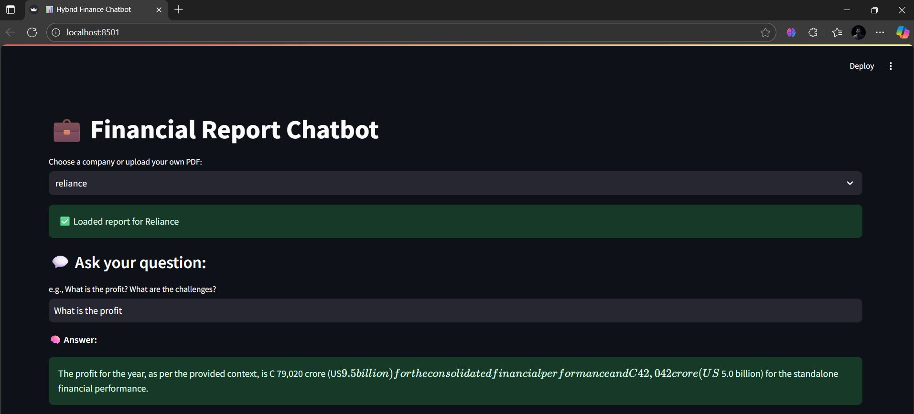

# AI Powered Financial Document QA Chatbot with RAG PDF Support

An **AI-powered financial chatbot** that answers questions directly from annual reports. Built using **LangChain**, **FAISS**, **Streamlit**, and **Mistral LLM via Ollama**, it supports both **preloaded company data** and **user-uploaded PDFs** and works **completely offline** with **no API keys or costs**.

---

##  Features

- **Offline & Free** – No API keys or cloud costs required
- **RAG Pipeline** – Retrieval Augmented Generation for better, more contextual responses
- **PDF Upload** – Users can upload their own annual reports for Q&A
- **Semantic Search** – Uses vector similarity with FAISS for accurate semantic search
- **Preloaded Reports** – Includes reports like Reliance, TCS, etc.
- **Streamlit Dashboard** – Simple and interactive UI

---

##  Tech Stack

| Layer            | Tools Used                                     |
|------------------|------------------------------------------------|
| LLM              | `Mistral` via `Ollama` (offline)               |
| Embeddings       | `HuggingFaceEmbeddings` (`all-MiniLM-L6-v2`)   |
| Vector DB        | `FAISS`                                        |
| Document Parsing | `PyPDF2`                                       |
| App UI           | `Streamlit`                                    |
| Framework        | `LangChain`                                    |

---

##  Screenshots

Here’s an example of the chatbot interface in action:




---

## ⚙ How to Run Locally

1. **Install dependencies**
    ```
    pip install -r requirements.txt
    ```

2. **Install Ollama and pull Mistral model**
    ```
    ollama run mistral
    ```

3. **Start the Streamlit app**
    ```
    streamlit run financial_chatbot_ui.py
    ```

---

##  How It Works

- Extracts text from uploaded or preloaded PDFs using PyPDF2.
- Splits the text and creates vector embeddings with HuggingFace.
- Stores those embeddings in FAISS for semantic search.
- Uses Mistral LLM (via Ollama) to generate answers based on the retrieved content chunks.
- Displays answers in a friendly Streamlit interface.

---

Enjoy using the AI-powered finance chatbot! 🎉
